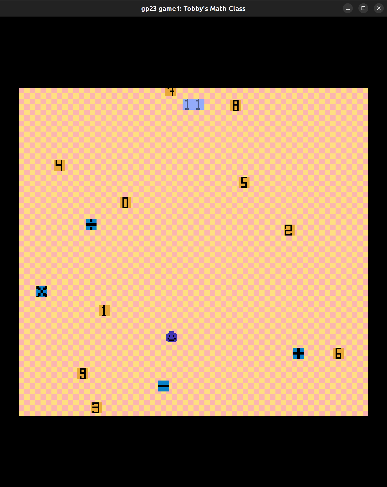

# Tobby's Math Class

Author:  Jiyoon Park

Design: (TODO: In two sentences or fewer, describe what is new and interesting about your game.)

Screen Shot:

How Your Asset Pipeline Works:

(TODO: describe the steps in your asset pipeline, from source files to tiles/backgrounds/whatever you upload to the PPU466.)

(TODO: make sure the source files you drew are included. You can [link](your/file.png) to them to be a bit fancier.)

How To Play:

Your goal is to navigate Tobby around the room to collect the target number as many times as you can. 

## Rules:

Tobby is a blob calculator that only can process integers. You need to collect numbers and symbols to reach the target number. 

- You can only use the numbers once. 
- But can use the symbols multiple times
- Once you have reached your number, press __g__ to evaluate if you are correct

### You will die if
- Tobby eats symbols when it needs numbers ( and vice versa )
- Tobby does not get the target number right
 

### Screen Elements
- __Target Number__ : shown on top of screen 
- __Final Score__ : shown at the center of the screen when Tobby dies

### HotKey
- __g__ : checks if Tobby's number is the same as target number
- __r__ : restarts the game
- __space__ : Makes Tobby faster ( but you cannot slow down so use it wisely)

(TODO: describe the controls and (if needed) goals/strategy.)

This game was built with [NEST](NEST.md).

