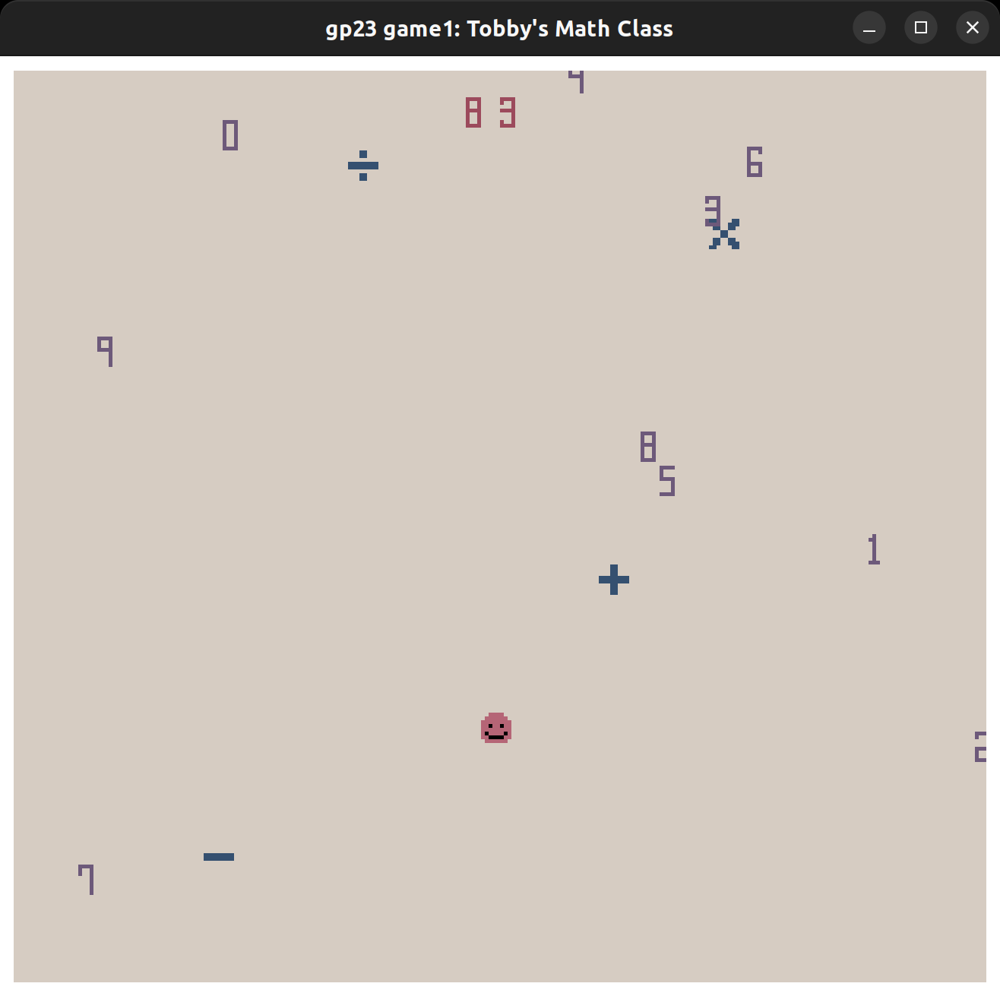

# Tobby's Math Class

Author: Jiyoon Park

Design: You are Tobby's gardian for today's math class. Tobby has to navigate around the classroom and collect materials to meet his target, but once Tobby eats a number, it does not appear again. (Also, remeber you are Tobby's gardian, which means you have to be responsible for remebering his collections : ) )

Screen Shot:

How Your Asset Pipeline Works:

All the assets are stored in the [dist/assets](/15-466-f23-base1/dist/assets/) and generated once when the game starts in the PlayMode.cpp file. It loads the png files and stores them all in tiles, then calls them when drawing. Palettes are shared between same tile types for efficency.

## How To Play:

Your goal is to navigate Tobby around the room to collect the target number as many times as you can.

## Rules:

Tobby is a blob calculator that only can process integers. You need to collect numbers and symbols to reach the target number.

- You can only use the numbers once.
- But can use the symbols multiple times
- Once you have reached your number, press **g** to evaluate if you are correct

### You will die if

- Tobby eats symbols when it needs numbers ( and vice versa )
- Tobby does not get the target number right

### Screen Elements

- **Target Number** : shown on top of screen
- **Final Score** : shown at the center of the screen when Tobby dies

### HotKey

- **g** : checks if Tobby's number is the same as target number
- **r** : restarts the game
- **space** : Makes Tobby faster ( but you cannot slow down so use it wisely)

This game was built with [NEST](NEST.md).
